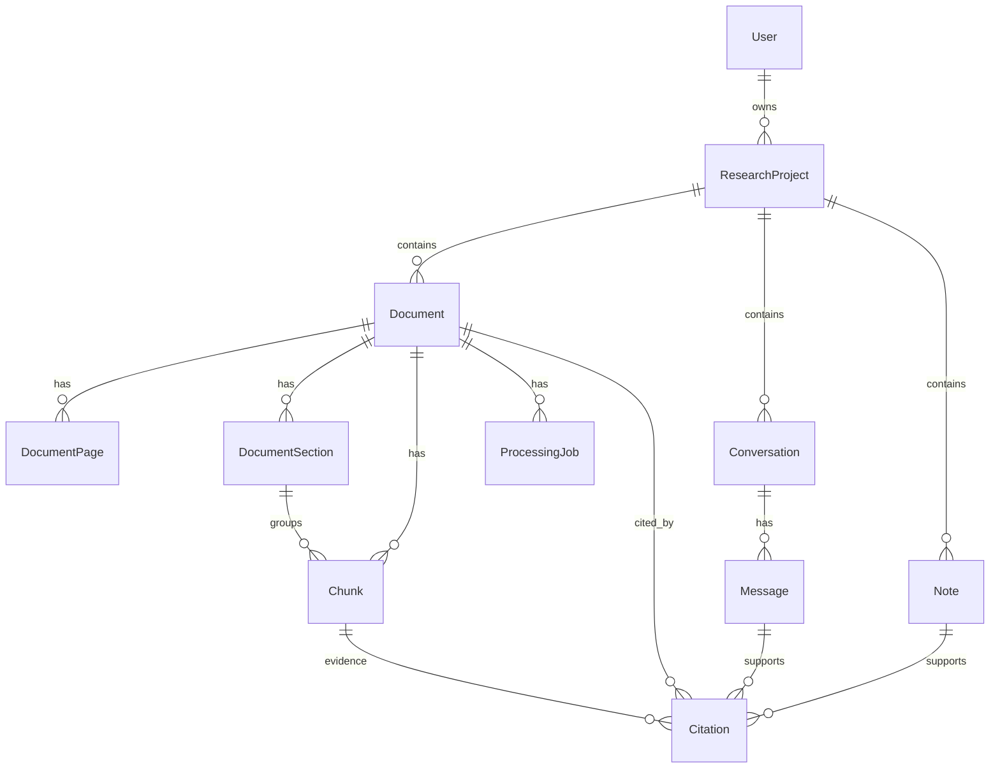

# Domain Model

## Deletion Behavior

- Deleting a `User` cascades to that user's `ResearchProject` records.
- Deleting a `ResearchProject` cascades to its documents, pages, sections,
  chunks, conversations, messages, notes, citations, and processing jobs.
- Deleting a `Document` cascades to its pages, sections, chunks, citations, and
  processing jobs.
- Deleting a `DocumentSection` keeps its chunks but sets `chunks.section_id` to
  null.
- Deleting a `Chunk` keeps citations but sets `citations.chunk_id` to null so
  the quoted evidence remains auditable.

## Duplicate Detection

Documents enforce a unique `(project_id, sha256_hash)` constraint so the same
PDF cannot be ingested twice into one project.
